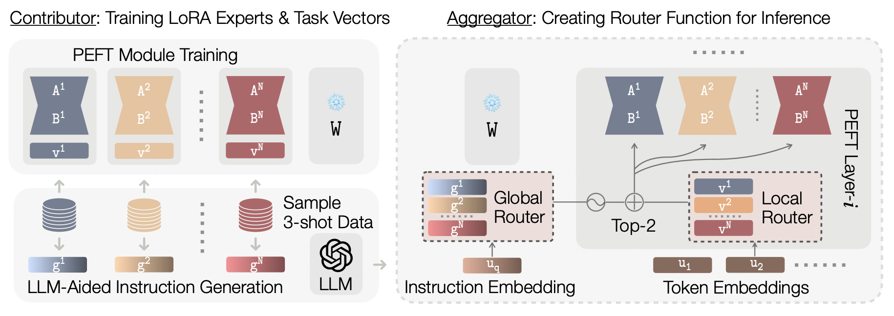

## 🪂 Glider: Global and Local Instruction-Driven Expert Router

<!--- BADGES: START --->
[][#license-gh-package]
[][#arxiv-paper-package]

[#license-gh-package]: https://lbesson.mit-license.org/

[#arxiv-paper-package]: https://arxiv.org/abs/2410.07172

<!--- BADGES: END --->

Official code for the paper "**Glider: Global and Local Instruction-Driven Expert Router**".
Our codebase is built upon [Phatgoose](https://github.com/r-three/phatgoose).

* Authors (* Equal
  Contribution): [Pingzhi Li*](https://pingzhili.github.io/), [Prateek Yadav*](https://prateeky2806.github.io/), [Jaehong Yoon](https://jaehong31.github.io/), [Jie Peng](https://openreview.net/profile?id=~Jie_Peng4), [Yi-Lin Sung](https://ylsung.github.io/), [Mohit Bansal](https://www.cs.unc.edu/~mbansal/)
  and [Tianlong Chen](https://tianlong-chen.github.io/)
* Paper: [arXiv](https://arxiv.org/abs/2410.07172)
* Checkpoints: [HuggingFace](https://huggingface.co/collections/MoE-UNC/glider-checkpoints-67142ab5485b75297d610886)

**Glider**—Solve held-in/-out tasks with a collection of specialized experts like LoRA at the same time!



### I. Abstract
The availability of performant pre-trained models has led to a proliferation of fine-tuned expert models that are
specialized to particular domains. This has enabled the creation of powerful and adaptive routing-based "Model MoErging"
methods with the goal of using expert modules to create an aggregate system with improved performance or generalization.
However, existing MoErging methods often prioritize generalization to unseen tasks at the expense of performance on
held-in tasks, which limits its practical applicability in real-world deployment scenarios. We observe that current
token-level routing mechanisms neglect the global semantic context of the input task. This token-wise independence
hinders effective expert selection for held-in tasks, as routing decisions fail to incorporate the semantic properties
of the task. To address this, we propose, Global and Local Instruction Driven Expert Router (GLIDER) that integrates a
multi-scale routing mechanism, encompassing a semantic global router and a learned local router. The global router
leverages LLM's advanced reasoning capabilities for semantic-related contexts to enhance expert selection. Given the
input query and LLM, the router generates semantic task instructions that guide the retrieval of the most relevant
experts across all layers. This global guidance is complemented by a local router that facilitates token-level routing
decisions within each module, enabling finer control and enhanced performance on unseen tasks. Our experiments using
T5-based models for T0 and FLAN tasks demonstrate that GLIDER achieves substantially improved held-in performance while
maintaining strong generalization on held-out tasks. We also perform ablations experiments to dive deeper into the
components of GLIDER. Our experiments highlight the importance of our multi-scale routing that leverages LLM-driven
semantic reasoning for MoErging methods.

### II. Installation

```bash
conda create -n glider python=3.9
conda activate glider
conda install git-lfs
pip install -r requirements.txt
pip uninstall peft -y
```

### III. Data Preparation

```bash
cd src && mkdir saved_runs && cd saved_runs
git lfs install
# Glider LLM-Generated task embeddings
git clone https://huggingface.co/MoE-UNC/gpt-generated-instruction-nomic-embeddings
# P3 LoRA checkpoints (derived from Phatgoose)
git clone https://huggingface.co/MoE-UNC/p3-lora-checkpoints
# FLAN LoRA checkpoints (derived from Phatgoose)
git clone https://huggingface.co/MoE-UNC/flan-lora-checkpoints
# Baseline- Arrow checkpoints
git clone https://huggingface.co/MoE-UNC/p3-lora-checkpoints-arrow
# Baseline - Merged Experts checkpoints (derived from Phatgoose)
git clone https://huggingface.co/MoE-UNC/phatgoose-checkpoints
```

### IV. Reproducing Results

Please check commands & comments in `src/scripts/paper-eval.sh` for reproducing results.

### V. Citation

```bibtex
@misc{li2024glidergloballocalinstructiondriven,
      title={Glider: Global and Local Instruction-Driven Expert Router}, 
      author={Pingzhi Li and Prateek Yadav and Jaehong Yoon and Jie Peng and Yi-Lin Sung and Mohit Bansal and Tianlong Chen},
      year={2024},
      eprint={2410.07172},
      archivePrefix={arXiv},
      primaryClass={cs.LG},
      url={https://arxiv.org/abs/2410.07172}, 
}
```
